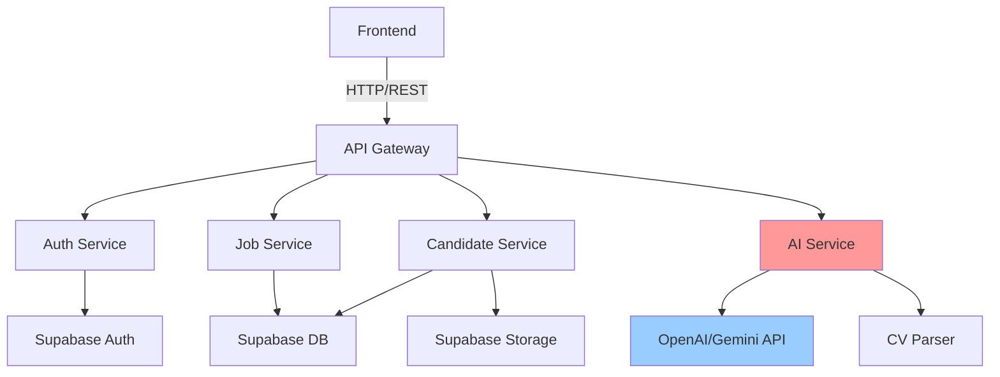
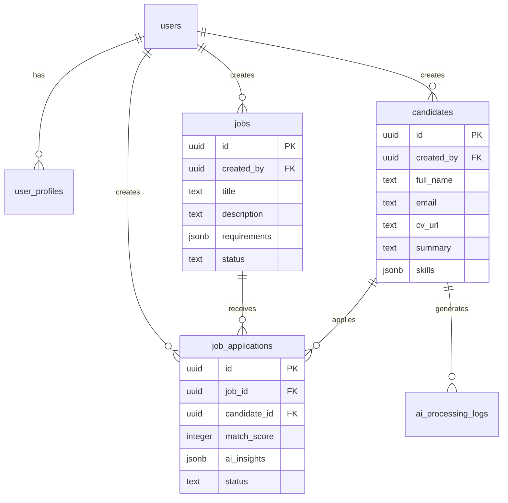

# AI Recruitment System - Technical Documentation

## 📋 Table of Contents

1. [System Overview](#system-overview)
2. [Backend Architecture](#backend-architecture)
3. [Supabase Database Schema](#supabase-database-schema)
4. [Frontend Requirements](#frontend-requirements)
5. [Missing Components & Recommendations](#missing-components--recommendations)

---

## 🎯 System Overview

**Purpose**: AI-powered recruitment screening system to help HR recruiters efficiently process and evaluate candidate CVs using artificial intelligence.

**Target User**: Maya - HR Recruiter who handles dozens to hundreds of CVs per job opening

**Core Value**: Intelligent decision-support tool that summarizes CVs, extracts skills, and matches candidates to job positions

---

## 🔧 Backend Architecture

### Technology Stack Recommendations

```
Backend Framework: Node.js + Express / Python + FastAPI
AI Integration: OpenAI API / Google Gemini API
File Processing: PDF parsing libraries (pdf-parse, PyPDF2)
Authentication: Supabase Auth
Storage: Supabase Storage (for CV files)
```

### Required API Endpoints

#### 1. **Authentication Endpoints**

```
POST /api/auth/register
POST /api/auth/login
POST /api/auth/logout
GET  /api/auth/me
```

#### 2. **Job Vacancy Endpoints**

```
GET    /api/jobs              # List all job openings
GET    /api/jobs/:id          # Get specific job details
POST   /api/jobs              # Create new job opening
PUT    /api/jobs/:id          # Update job opening
DELETE /api/jobs/:id          # Delete job opening
```

#### 3. **Candidate Endpoints**

```
GET    /api/candidates                    # List all candidates
GET    /api/candidates/:id                # Get candidate details
POST   /api/candidates                    # Upload new candidate CV
PUT    /api/candidates/:id                # Update candidate info
DELETE /api/candidates/:id                # Delete candidate
POST   /api/candidates/:id/upload-cv      # Upload CV file
```

#### 4. **AI Processing Endpoints**

```
POST   /api/ai/summarize-cv/:candidateId  # Generate CV summary
POST   /api/ai/extract-skills/:candidateId # Extract skills from CV
POST   /api/ai/match-job/:candidateId/:jobId # Calculate matching score
GET    /api/ai/insights/:candidateId/:jobId # Get AI insights
```

#### 5. **Dashboard Endpoints**

```
GET    /api/dashboard/stats               # Get recruitment statistics
GET    /api/dashboard/recent-candidates   # Recent candidates
GET    /api/dashboard/top-matches/:jobId  # Top matching candidates
```

### Backend Services Architecture



### Key Backend Functions

#### CV Processing Pipeline

```javascript
// Example: CV Processing Flow
async function processCandidateCV(candidateId, cvFile) {
  // 1. Upload CV to Supabase Storage
  const cvUrl = await uploadToStorage(cvFile);

  // 2. Extract text from PDF
  const cvText = await parsePDF(cvFile);

  // 3. AI Summarization
  const summary = await aiSummarize(cvText);

  // 4. Skill Extraction
  const skills = await aiExtractSkills(cvText);

  // 5. Save to database
  await updateCandidate(candidateId, {
    cv_url: cvUrl,
    cv_text: cvText,
    summary: summary,
    skills: skills,
  });

  return { summary, skills };
}
```

#### Job Matching Algorithm

```javascript
// Example: Matching Score Calculation
async function calculateMatchScore(candidateId, jobId) {
  const candidate = await getCandidate(candidateId);
  const job = await getJob(jobId);

  // Use AI to analyze match
  const matchAnalysis = await aiAnalyzeMatch({
    candidateSkills: candidate.skills,
    candidateExperience: candidate.summary,
    jobRequirements: job.requirements,
    jobDescription: job.description,
  });

  return {
    score: matchAnalysis.score, // 0-100
    strengths: matchAnalysis.strengths,
    gaps: matchAnalysis.gaps,
    recommendation: matchAnalysis.recommendation,
  };
}
```

---

## 🗄️ Supabase Database Schema

### Database Tables

#### 1. **users** (Supabase Auth handles this)

```sql
-- Managed by Supabase Auth
-- Additional profile data can be stored in a separate table
```

#### 2. **user_profiles**

```sql
CREATE TABLE user_profiles (
  id UUID PRIMARY KEY REFERENCES auth.users(id),
  full_name TEXT NOT NULL,
  role TEXT DEFAULT 'recruiter',
  company_name TEXT,
  avatar_url TEXT,
  created_at TIMESTAMP WITH TIME ZONE DEFAULT NOW(),
  updated_at TIMESTAMP WITH TIME ZONE DEFAULT NOW()
);
```

#### 3. **jobs**

```sql
CREATE TABLE jobs (
  id UUID PRIMARY KEY DEFAULT uuid_generate_v4(),
  created_by UUID REFERENCES auth.users(id) NOT NULL,
  title TEXT NOT NULL,
  department TEXT,
  location TEXT,
  employment_type TEXT, -- 'full-time', 'part-time', 'contract'
  description TEXT NOT NULL,
  requirements JSONB, -- Array of required skills/qualifications
  responsibilities TEXT,
  salary_range TEXT,
  status TEXT DEFAULT 'open', -- 'open', 'closed', 'draft'
  created_at TIMESTAMP WITH TIME ZONE DEFAULT NOW(),
  updated_at TIMESTAMP WITH TIME ZONE DEFAULT NOW()
);

-- Index for faster queries
CREATE INDEX idx_jobs_status ON jobs(status);
CREATE INDEX idx_jobs_created_by ON jobs(created_by);
```

#### 4. **candidates**

```sql
CREATE TABLE candidates (
  id UUID PRIMARY KEY DEFAULT uuid_generate_v4(),
  created_by UUID REFERENCES auth.users(id) NOT NULL,
  full_name TEXT NOT NULL,
  email TEXT NOT NULL,
  phone TEXT,
  cv_url TEXT, -- Supabase Storage URL
  cv_text TEXT, -- Extracted text from CV
  summary TEXT, -- AI-generated summary
  skills JSONB, -- Array of extracted skills
  experience_years INTEGER,
  education JSONB,
  status TEXT DEFAULT 'new', -- 'new', 'screening', 'interview', 'rejected', 'hired'
  created_at TIMESTAMP WITH TIME ZONE DEFAULT NOW(),
  updated_at TIMESTAMP WITH TIME ZONE DEFAULT NOW()
);

-- Indexes
CREATE INDEX idx_candidates_email ON candidates(email);
CREATE INDEX idx_candidates_status ON candidates(status);
CREATE INDEX idx_candidates_created_by ON candidates(created_by);
```

#### 5. **job_applications**

```sql
CREATE TABLE job_applications (
  id UUID PRIMARY KEY DEFAULT uuid_generate_v4(),
  job_id UUID REFERENCES jobs(id) ON DELETE CASCADE,
  candidate_id UUID REFERENCES candidates(id) ON DELETE CASCADE,
  applied_by UUID REFERENCES auth.users(id) NOT NULL,
  status TEXT DEFAULT 'pending', -- 'pending', 'reviewing', 'shortlisted', 'rejected', 'hired'
  match_score INTEGER, -- 0-100
  ai_insights JSONB, -- AI-generated matching insights
  notes TEXT,
  created_at TIMESTAMP WITH TIME ZONE DEFAULT NOW(),
  updated_at TIMESTAMP WITH TIME ZONE DEFAULT NOW(),

  UNIQUE(job_id, candidate_id)
);

-- Indexes
CREATE INDEX idx_applications_job ON job_applications(job_id);
CREATE INDEX idx_applications_candidate ON job_applications(candidate_id);
CREATE INDEX idx_applications_score ON job_applications(match_score DESC);
```

#### 6. **ai_processing_logs**

```sql
CREATE TABLE ai_processing_logs (
  id UUID PRIMARY KEY DEFAULT uuid_generate_v4(),
  candidate_id UUID REFERENCES candidates(id) ON DELETE CASCADE,
  job_id UUID REFERENCES jobs(id) ON DELETE SET NULL,
  processing_type TEXT NOT NULL, -- 'summarize', 'extract_skills', 'match_job'
  input_data JSONB,
  output_data JSONB,
  tokens_used INTEGER,
  processing_time_ms INTEGER,
  status TEXT DEFAULT 'success', -- 'success', 'failed'
  error_message TEXT,
  created_at TIMESTAMP WITH TIME ZONE DEFAULT NOW()
);

-- Index
CREATE INDEX idx_ai_logs_candidate ON ai_processing_logs(candidate_id);
CREATE INDEX idx_ai_logs_type ON ai_processing_logs(processing_type);
```

### Row Level Security (RLS) Policies

```sql
-- Enable RLS on all tables
ALTER TABLE user_profiles ENABLE ROW LEVEL SECURITY;
ALTER TABLE jobs ENABLE ROW LEVEL SECURITY;
ALTER TABLE candidates ENABLE ROW LEVEL SECURITY;
ALTER TABLE job_applications ENABLE ROW LEVEL SECURITY;
ALTER TABLE ai_processing_logs ENABLE ROW LEVEL SECURITY;

-- Example: Jobs table policies
CREATE POLICY "Users can view all jobs"
  ON jobs FOR SELECT
  USING (auth.role() = 'authenticated');

CREATE POLICY "Users can create jobs"
  ON jobs FOR INSERT
  WITH CHECK (auth.uid() = created_by);

CREATE POLICY "Users can update their own jobs"
  ON jobs FOR UPDATE
  USING (auth.uid() = created_by);

CREATE POLICY "Users can delete their own jobs"
  ON jobs FOR DELETE
  USING (auth.uid() = created_by);

-- Similar policies needed for other tables
```

### Supabase Storage Buckets

```sql
-- Create storage bucket for CVs
INSERT INTO storage.buckets (id, name, public)
VALUES ('cvs', 'cvs', false);

-- Storage policy: Users can upload CVs
CREATE POLICY "Authenticated users can upload CVs"
  ON storage.objects FOR INSERT
  WITH CHECK (
    bucket_id = 'cvs' AND
    auth.role() = 'authenticated'
  );

-- Storage policy: Users can view CVs
CREATE POLICY "Authenticated users can view CVs"
  ON storage.objects FOR SELECT
  USING (
    bucket_id = 'cvs' AND
    auth.role() = 'authenticated'
  );
```

### Database Relationships Diagram



---

## 💻 Frontend Requirements

### Technology Stack Recommendations

```
Framework: React + TypeScript / Next.js
UI Library: Material-UI / Tailwind CSS + shadcn/ui
State Management: React Query + Zustand / Redux Toolkit
Forms: React Hook Form + Zod validation
File Upload: react-dropzone
Charts: Recharts / Chart.js
Routing: React Router / Next.js routing
```

### Required Pages & Components

#### 1. **Authentication Pages**

- `/login` - Login page
- `/register` - Registration page
- `/forgot-password` - Password recovery

#### 2. **Dashboard Page** (`/dashboard`)

```
Components needed:
- StatisticsCards (total jobs, candidates, applications)
- RecentCandidatesTable
- JobOpeningsOverview
- MatchingScoreChart
- QuickActions (Create Job, Upload CV)
```

#### 3. **Jobs Management** (`/jobs`)

```
Pages:
- /jobs - List all job openings
- /jobs/new - Create new job
- /jobs/:id - View job details
- /jobs/:id/edit - Edit job
- /jobs/:id/candidates - View candidates for this job

Components:
- JobCard
- JobForm
- JobFilters (status, department, date)
- JobDetailsPanel
```

#### 4. **Candidates Management** (`/candidates`)

```
Pages:
- /candidates - List all candidates
- /candidates/new - Add new candidate
- /candidates/:id - View candidate profile
- /candidates/:id/edit - Edit candidate

Components:
- CandidateCard
- CandidateUploadForm (with CV upload)
- CandidateFilters (skills, experience, status)
- CVViewer
- AISummaryPanel
- SkillsTagList
```

#### 5. **Matching & Comparison** (`/matching`)

```
Pages:
- /matching/:jobId - View all candidates for a job with scores
- /compare - Compare multiple candidates side-by-side

Components:
- MatchScoreCard
- AIInsightsPanel
- CandidateComparisonTable
- SkillsMatchVisualization
```

### Key Frontend Features

#### CV Upload Component

```typescript
// Example: CV Upload with AI Processing
interface CVUploadProps {
  candidateId: string;
  onUploadComplete: (data: any) => void;
}

function CVUploadComponent({ candidateId, onUploadComplete }: CVUploadProps) {
  const [uploading, setUploading] = useState(false);
  const [processing, setProcessing] = useState(false);

  const handleUpload = async (file: File) => {
    setUploading(true);

    // 1. Upload file
    const { data: uploadData } = await supabase.storage
      .from('cvs')
      .upload(`${candidateId}/${file.name}`, file);

    setUploading(false);
    setProcessing(true);

    // 2. Trigger AI processing
    const response = await fetch(`/api/ai/summarize-cv/${candidateId}`, {
      method: 'POST'
    });

    const result = await response.json();
    setProcessing(false);
    onUploadComplete(result);
  };

  return (
    <Dropzone onDrop={handleUpload}>
      {uploading && <Spinner />}
      {processing && <AIProcessingIndicator />}
    </Dropzone>
  );
}
```

#### Candidate-Job Matching Display

```typescript
// Example: Match Score Display
interface MatchScoreProps {
  score: number;
  insights: {
    strengths: string[];
    gaps: string[];
    recommendation: string;
  };
}

function MatchScoreDisplay({ score, insights }: MatchScoreProps) {
  return (
    <Card>
      <CircularProgress value={score} label={`${score}% Match`} />

      <Section title="Strengths">
        {insights.strengths.map(s => <Badge>{s}</Badge>)}
      </Section>

      <Section title="Skill Gaps">
        {insights.gaps.map(g => <Badge variant="warning">{g}</Badge>)}
      </Section>

      <AIRecommendation text={insights.recommendation} />
    </Card>
  );
}
```

### Frontend State Management

```typescript
// Example: Zustand store for candidates
interface CandidateStore {
  candidates: Candidate[];
  selectedCandidate: Candidate | null;
  filters: CandidateFilters;
  setFilters: (filters: CandidateFilters) => void;
  fetchCandidates: () => Promise<void>;
}

const useCandidateStore = create<CandidateStore>((set) => ({
  candidates: [],
  selectedCandidate: null,
  filters: {},
  setFilters: (filters) => set({ filters }),
  fetchCandidates: async () => {
    const { data } = await supabase
      .from("candidates")
      .select("*")
      .order("created_at", { ascending: false });
    set({ candidates: data });
  },
}));
```

---

## ⚠️ Missing Components & Recommendations

### 🔴 Critical Missing Components

#### 1. **AI Integration Strategy**

> [!CAUTION]
> **Missing**: No AI service provider specified or API integration plan

**Recommendations**:

- Choose AI provider: OpenAI GPT-4, Google Gemini, or Anthropic Claude
- Set up API keys and rate limiting
- Implement token usage tracking
- Create fallback mechanisms for API failures
- Budget planning for AI API costs

**Implementation Priority**: 🔥 **HIGH**

#### 2. **CV Parsing Library**

> [!WARNING]
> **Missing**: No PDF/document parsing solution defined

**Recommendations**:

- Backend: `pdf-parse` (Node.js) or `PyPDF2` (Python)
- Consider OCR for scanned documents: `Tesseract.js`
- Handle multiple formats: PDF, DOCX, TXT
- Text extraction quality validation

**Implementation Priority**: 🔥 **HIGH**

#### 3. **Authentication Flow**

> [!IMPORTANT]
> **Missing**: Detailed authentication implementation

**Recommendations**:

- Use Supabase Auth (already included in stack)
- Implement email verification
- Add password reset flow
- Consider social login (Google, LinkedIn)
- Role-based access control (RBAC)

**Implementation Priority**: 🔥 **HIGH**

#### 4. **File Upload Security**

> [!CAUTION]
> **Missing**: File validation and security measures

**Recommendations**:

```javascript
// File validation rules
const CV_UPLOAD_RULES = {
  maxSize: 10 * 1024 * 1024, // 10MB
  allowedTypes: [
    "application/pdf",
    "application/msword",
    "application/vnd.openxmlformats-officedocument.wordprocessingml.document",
  ],
  virusScan: true, // Use ClamAV or similar
  sanitizeFilename: true,
};
```

**Implementation Priority**: 🔥 **HIGH**

---

### 🟡 Important Missing Features

#### 5. **Error Handling & Logging**

> [!WARNING]
> **Missing**: Comprehensive error handling strategy

**Recommendations**:

- Frontend: Error boundaries, toast notifications
- Backend: Centralized error handler, logging service (Winston, Pino)
- AI failures: Graceful degradation, retry logic
- User-friendly error messages

**Implementation Priority**: 🟠 **MEDIUM**

#### 6. **Data Validation**

> [!IMPORTANT]
> **Missing**: Input validation schemas

**Recommendations**:

- Use Zod or Yup for schema validation
- Validate on both frontend and backend
- Email format, phone number validation
- Required fields enforcement

**Example**:

```typescript
import { z } from "zod";

const JobSchema = z.object({
  title: z.string().min(3).max(100),
  description: z.string().min(50),
  requirements: z.array(z.string()).min(1),
  employment_type: z.enum(["full-time", "part-time", "contract"]),
  salary_range: z.string().optional(),
});
```

**Implementation Priority**: 🟠 **MEDIUM**

#### 7. **Search & Filtering**

> [!NOTE]
> **Missing**: Advanced search capabilities

**Recommendations**:

- Full-text search on candidate names, skills
- Filter by: skills, experience, education, status
- Sort by: match score, date added, name
- Consider Supabase full-text search or Algolia

**Implementation Priority**: 🟠 **MEDIUM**

#### 8. **Pagination**

> [!NOTE]
> **Missing**: Data pagination for large datasets

**Recommendations**:

- Implement cursor-based or offset pagination
- Default page size: 20-50 items
- Infinite scroll or page numbers
- Supabase supports pagination natively

**Implementation Priority**: 🟠 **MEDIUM**

---

### 🟢 Nice-to-Have Features

#### 9. **Email Notifications**

**Missing**: Communication system

**Recommendations**:

- Email candidates about application status
- Notify recruiters of new applications
- Use Supabase Edge Functions + Resend/SendGrid
- Email templates for consistency

**Implementation Priority**: 🟢 **LOW**

#### 10. **Analytics & Reporting**

**Missing**: Recruitment metrics and insights

**Recommendations**:

- Time-to-hire metrics
- Source of hire tracking
- Candidate pipeline visualization
- Export reports to CSV/PDF

**Implementation Priority**: 🟢 **LOW**

#### 11. **Collaborative Features**

**Missing**: Team collaboration tools

**Recommendations**:

- Comments on candidates
- Share candidate profiles
- Team member assignments
- Activity feed

**Implementation Priority**: 🟢 **LOW**

#### 12. **Mobile Responsiveness**

**Missing**: Mobile-first design consideration

**Recommendations**:

- Responsive design for all pages
- Touch-friendly UI elements
- Consider Progressive Web App (PWA)
- Mobile CV upload via camera

**Implementation Priority**: 🟠 **MEDIUM**

---

## 📊 Implementation Roadmap

### Phase 1: MVP (Minimum Viable Product)

**Timeline**: 2-3 weeks

```
✅ Core Features:
- [ ] User authentication (Supabase Auth)
- [ ] Job CRUD operations
- [ ] Candidate CRUD operations
- [ ] CV upload to Supabase Storage
- [ ] Basic AI summarization
- [ ] Simple dashboard
```

### Phase 2: AI Enhancement

**Timeline**: 1-2 weeks

```
✅ AI Features:
- [ ] Skill extraction
- [ ] Job-candidate matching algorithm
- [ ] AI insights generation
- [ ] Match score calculation
```

### Phase 3: UX Improvements

**Timeline**: 1-2 weeks

```
✅ User Experience:
- [ ] Advanced filtering & search
- [ ] Candidate comparison
- [ ] Pagination
- [ ] Error handling
- [ ] Loading states
```

### Phase 4: Polish & Scale

**Timeline**: 1 week

```
✅ Production Ready:
- [ ] Performance optimization
- [ ] Security hardening
- [ ] Email notifications
- [ ] Analytics
- [ ] Documentation
```

---

## 🔐 Security Checklist

> [!CAUTION]
> Critical security measures that MUST be implemented

- [ ] **RLS Policies**: Enable Row Level Security on all Supabase tables
- [ ] **File Upload Validation**: Restrict file types, sizes, and scan for malware
- [ ] **API Rate Limiting**: Prevent abuse of AI endpoints
- [ ] **Input Sanitization**: Prevent SQL injection and XSS attacks
- [ ] **HTTPS Only**: Enforce secure connections
- [ ] **Environment Variables**: Never expose API keys in frontend
- [ ] **CORS Configuration**: Restrict allowed origins
- [ ] **Data Encryption**: Encrypt sensitive data at rest

---

## 🚀 Getting Started

### 1. Set Up Supabase Project

```bash
# Create new Supabase project at https://supabase.com
# Copy your project URL and anon key
```

### 2. Initialize Database

```sql
-- Run the SQL schema provided above in Supabase SQL Editor
-- Enable RLS policies
-- Create storage buckets
```

### 3. Backend Setup

```bash
# Example: Node.js + Express
npm init -y
npm install express @supabase/supabase-js openai dotenv cors
npm install -D typescript @types/node @types/express

# Create .env file
SUPABASE_URL=your_supabase_url
SUPABASE_ANON_KEY=your_anon_key
SUPABASE_SERVICE_KEY=your_service_key
OPENAI_API_KEY=your_openai_key
```

### 4. Frontend Setup

```bash
# Example: React + Vite
npm create vite@latest frontend -- --template react-ts
cd frontend
npm install @supabase/supabase-js @tanstack/react-query zustand react-router-dom
npm install react-hook-form zod @hookform/resolvers
npm install react-dropzone recharts
```

---

## 📚 Additional Resources

### Supabase Documentation

- [Supabase Auth Guide](https://supabase.com/docs/guides/auth)
- [Row Level Security](https://supabase.com/docs/guides/auth/row-level-security)
- [Storage Guide](https://supabase.com/docs/guides/storage)

### AI Integration

- [OpenAI API Documentation](https://platform.openai.com/docs)
- [Google Gemini API](https://ai.google.dev/docs)

### Frontend Libraries

- [React Query](https://tanstack.com/query/latest)
- [Zustand](https://github.com/pmndrs/zustand)
- [shadcn/ui](https://ui.shadcn.com/)

---

## 💡 Pro Tips

> [!TIP]
> **Cost Optimization**: Cache AI responses in the database to avoid re-processing the same CV multiple times

> [!TIP]
> **Performance**: Use Supabase Realtime subscriptions for live updates on candidate status changes

> [!TIP]
> **User Experience**: Show progress indicators during AI processing (can take 5-10 seconds)

> [!TIP]
> **Data Quality**: Implement a feedback loop where recruiters can rate AI suggestions to improve accuracy over time

---

**Document Version**: 1.0  
**Last Updated**: 2026-01-28  
**Author**: Technical Documentation for AI Recruitment System
